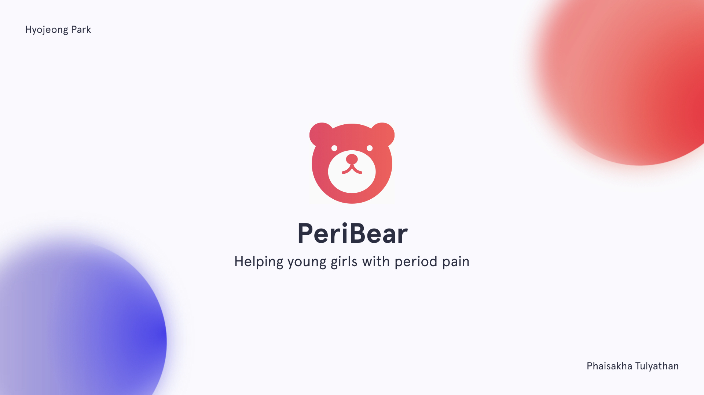

# PeriBear
> Yonsei University Social Innovation Capstone Project 2

> Won Social Innovation Award (first place) at Social IoT Project 2018, hosted by [Design Factory Global Network](https://dfgn.org/).

## What is PeriBear?
PeriBear is an emotional support bear that helps you bear with your period.

## Problem Statement
Half of the human race experience periods every month.
No matter how many times we experience it, it’s always stressful to keep track of when it’s coming and cope up with period pain.

## Functions
* uses ambient light to tell you when your period is coming.
* heats up so that you can hug it to relieve your period pain.
* PeriBear app sends you notifications about your period.

## Team
Haley Park([@hyojeongpark](https://github.com/hyojeongpark)),
Phai Tulyathan([@phaituly](https://github.com/phaituly))
